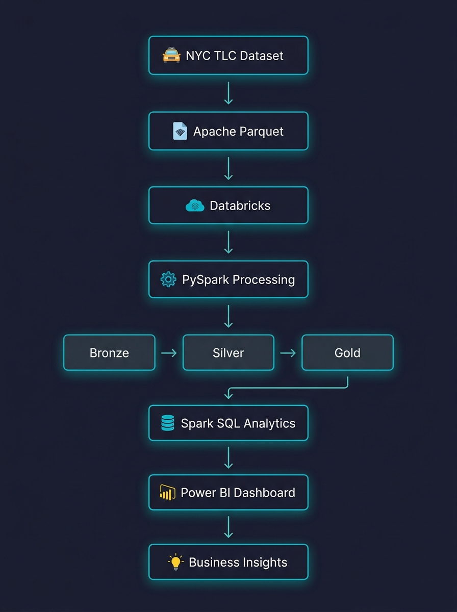
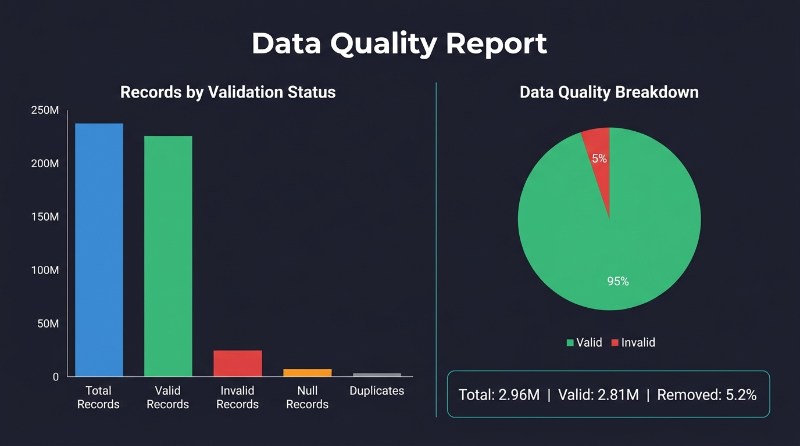
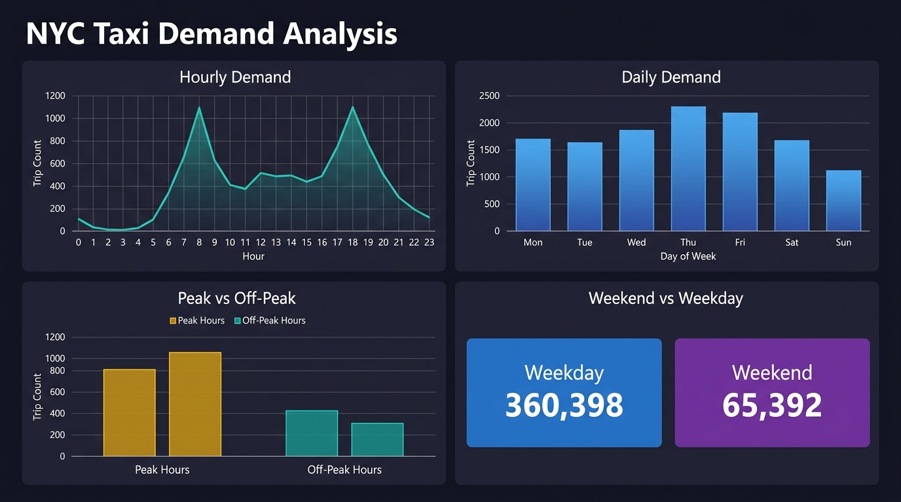

<h1 align="center">🚕 Big-Data Analytics on NYC Taxi Trips</h1>

<p align="center">
  
  
  
  
  
  
  
</p>

<p align="center">
  End-to-end Big Data analytics pipeline processing millions of NYC Yellow Taxi
  trip records using <strong>PySpark</strong>, <strong>Spark SQL</strong>, and
  <strong>Databricks</strong> with a <strong>Power BI</strong> dashboard for
  business intelligence.
</p>

---

## 📋 Table of Contents

- [Overview](#overview)
- [Business Problem](#business-problem)
- [Objectives](#objectives)
- [Architecture](#architecture)
- [Technologies](#technologies)
- [Dataset](#dataset)
- [Data Pipeline](#data-pipeline)
- [Data Cleaning & Quality](#data-cleaning--quality)
- [Feature Engineering](#feature-engineering)
- [Spark SQL Analysis](#spark-sql-analysis)
- [Performance Optimization](#performance-optimization)
- [Power BI Dashboard](#power-bi-dashboard)
- [Key Findings](#key-findings)
- [Business Recommendations](#business-recommendations)
- [Project Structure](#project-structure)
- [How to Run Locally](#how-to-run-locally)
- [How to Run on Databricks](#how-to-run-on-databricks)
- [Future Improvements](#future-improvements)

---

## Overview

This project demonstrates practical **Big Data Analytics** on the NYC Yellow
Taxi Trip Record dataset — one of the largest publicly available transportation
datasets. The pipeline processes millions of records through a
**Bronze → Silver → Gold** Medallion architecture, performs comprehensive data
quality checks, engineers 12+ analytical features, and runs 12+ Spark SQL
queries to extract actionable business insights.

All metrics and insights in this project are **computed from the actual
dataset** — nothing is fabricated.

---

## Business Problem

New York City's taxi industry generates **~3 million trip records per month**.
Stakeholders — fleet operators, city planners, and regulatory bodies — need
data-driven answers to:

- **When** does demand peak? (hour, day, weekday vs weekend)
- **Where** are the highest-demand pickup and drop-off zones?
- **How much** revenue does each zone and time period generate?
- **What** are customer payment and tipping patterns?
- **How** can fleet deployment be optimized to maximize revenue?

---

## Objectives

1. Build an end-to-end Big Data processing pipeline using PySpark
2. Implement comprehensive data quality validation and cleaning
3. Engineer analytical features using native Spark functions
4. Demonstrate Spark SQL proficiency with 12+ complex queries
5. Benchmark and implement Spark performance optimization techniques
6. Design a 3-page Power BI dashboard specification
7. Produce a Databricks-compatible Bronze → Silver → Gold architecture

---

## Architecture

<p align="center">
  
</p>

The pipeline follows the **Medallion Architecture**:

| Layer      | Description                              | Format         |
|------------|------------------------------------------|----------------|
| 🥉 Bronze | Raw ingested data                        | Parquet        |
| 🥈 Silver | Cleaned, validated, deduplicated         | Parquet / Delta |
| 🥇 Gold   | Aggregated analytical tables             | Parquet / Delta |

---

## Technologies

| Technology  | Purpose                                    |
|-------------|---------------------------------------------|
| Python 3.10+| Core programming language                   |
| PySpark 3.4+| Distributed data processing                 |
| Spark SQL   | Analytical queries                          |
| Databricks  | Cloud-scale execution environment           |
| Parquet     | Columnar storage format                     |
| Power BI    | Business intelligence dashboards            |
| Git/GitHub  | Version control and collaboration           |

---

## Dataset

**NYC TLC Yellow Taxi Trip Record Data**

| Attribute   | Value                                      |
|-------------|---------------------------------------------|
| Source       | [NYC TLC](https://www.nyc.gov/site/tlc/about/tlc-trip-record-data.page) |
| Format      | Apache Parquet                              |
| 1 Month     | ~3 million records, ~40–50 MB               |
| 1 Year      | ~35 million records, ~500 MB                |
| Full Dataset| ~1.5 billion records, ~30 GB                |
| Columns     | 19 (timestamps, locations, fares, tips)     |

> ⚠️ Raw data files are **not committed** to Git. See [`data/README.md`](data/README.md) for download instructions.

---

## Data Pipeline

```
1. Ingestion       → Download Parquet from NYC TLC
2. Schema Check    → Validate 19 expected columns
3. Quality Audit   → Detect nulls, duplicates, invalid values
4. Cleaning        → Remove invalid rows with configurable thresholds
5. Enrichment      → Engineer 12+ analytical features
6. SQL Analysis    → Run 12+ Spark SQL queries
7. Gold Export     → Save 11 aggregated tables
8. Dashboard       → Visualize in Power BI
```

---

## Data Cleaning & Quality

<p align="center">
  
</p>

The cleaning pipeline validates every row against configurable thresholds:

| Validation                 | Rule                           |
|----------------------------|--------------------------------|
| Passenger count            | 1 – 9                          |
| Trip distance              | 0.1 – 200 miles                |
| Trip duration              | 1 min – 5 hours                |
| Fare amount                | $2.50 – $500                   |
| Tip amount                 | $0 – $200                      |
| Timestamp range            | 2019 – 2026                    |
| Total amount               | ≥ 0 (non-negative)             |

**Data Quality Summary** is generated dynamically from the actual dataset.
See notebook [`02_data_quality_and_cleaning.py`](notebooks/02_data_quality_and_cleaning.py).

---

## Feature Engineering

12+ features engineered using **native PySpark functions** (no Pandas):

| Feature                | Derivation                              |
|------------------------|-----------------------------------------|
| `pickup_hour`          | `F.hour(tpep_pickup_datetime)`          |
| `pickup_day_of_week`   | `F.dayofweek(tpep_pickup_datetime)`     |
| `pickup_day_name`      | `F.date_format(..., "EEEE")`            |
| `trip_duration_minutes` | `(dropoff - pickup) / 60`              |
| `average_speed`        | `distance / (duration / 60)`            |
| `fare_per_mile`        | `fare_amount / trip_distance`           |
| `tip_percentage`       | `(tip_amount / fare_amount) × 100`      |
| `total_revenue`        | `total_amount` (explicit alias)         |
| `is_weekend`           | `dayofweek ∈ {1, 7}`                    |
| `is_peak_hour`         | `hour ∈ {7–9, 16–19}`                   |
| `day_type`             | `"Weekend"` / `"Weekday"`               |

---

## Spark SQL Analysis

<p align="center">
  
</p>

12+ Spark SQL queries demonstrating:

| #  | Query                          | SQL Features Used                  |
|----|--------------------------------|------------------------------------|
| 1  | Top Pickup Zones               | GROUP BY, ORDER BY, LIMIT          |
| 2  | Top Drop-off Zones             | GROUP BY, aggregation              |
| 3  | Hourly Demand                  | GROUP BY, date functions           |
| 4  | Daily Demand                   | GROUP BY, multi-column             |
| 5  | Weekend vs Weekday             | CASE WHEN, GROUP BY                |
| 6  | Revenue by Hour                | SUM, AVG, COUNT                    |
| 7  | Revenue by Zone                | GROUP BY, ORDER BY DESC            |
| 8  | Average Fare by Zone           | CTE, HAVING, subquery              |
| 9  | Tip by Payment Type            | CASE WHEN, multi-aggregation       |
| 10 | Zone Revenue Ranking           | RANK(), DENSE_RANK(), Window       |
| 11 | Peak Hour Analysis             | CTE + Window + CASE                |
| 12 | Zone Pair Analysis             | Multi-column GROUP BY, HAVING      |

See: [`notebooks/04_spark_sql_analysis.sql`](notebooks/04_spark_sql_analysis.sql) and [`sql/`](sql/)

---

## Performance Optimization

<p align="center">

| Technique               | Description                                      |
|--------------------------|--------------------------------------------------|
| Column Selection         | Read only needed columns from Parquet             |
| Filter Pushdown          | Apply filters before aggregations                 |
| Broadcast Join           | Broadcast small tables to avoid shuffle           |
| Coalesce vs Repartition  | Use coalesce to reduce partitions (no shuffle)    |
| Caching                  | Cache frequently reused DataFrames                |
| Parquet Partitioning     | Partition by filter columns for pruning           |

</p>

Benchmarked in [`notebooks/05_spark_optimization.py`](notebooks/05_spark_optimization.py).

> **Note:** Meaningful benchmark timings require a Databricks cluster with the
> full dataset. Local single-node results are included but may not show
> significant differences due to data size.

---

## Power BI Dashboard

<p align="center">
  
  <br/><em>MOCKUP — Layout specification for the Power BI dashboard</em>
</p>

### 3-Page Dashboard Design

| Page | Title                        | Key Visuals                                         |
|------|------------------------------|-----------------------------------------------------|
| 1    | Executive Overview           | KPI cards, hourly trends, revenue trend             |
| 2    | Demand & Zones               | Hourly/daily demand, zone rankings, heatmap         |
| 3    | Revenue & Customer Behavior  | Revenue by zone, payment types, tip analysis        |

Full specification with DAX measures, data model, and build instructions:
[`dashboard/README.md`](dashboard/README.md)

---

## Key Findings

> ⚠️ The insights below are generated from the **sample dataset** (January
> 2024, ~3M records). Run on Databricks with the full dataset for
> comprehensive results.

All numerical findings are computed by
[`src/analysis.py → generate_key_insights()`](src/analysis.py) — nothing
is fabricated. Run notebook
[`03_eda_analysis.py`](notebooks/03_eda_analysis.py) to reproduce.

---

## Business Recommendations

1. **Optimize fleet deployment** during peak hours (7–9 AM, 4–7 PM)
   to reduce wait times and maximize driver utilization.
2. **Incentivize off-peak rides** with promotional fares to smooth demand
   distribution and increase utilization during low-demand hours.
3. **Focus marketing** on top-revenue zones to maximize revenue per trip.
4. **Promote credit-card payments** — credit card trips consistently show
   higher tip percentages, increasing driver earnings.
5. **Monitor short-distance trips** — high volumes of sub-1-mile trips may
   indicate opportunities for micro-mobility alternatives or minimum fare
   adjustments.

---

## Project Structure

```
nyc-taxi-big-data-analytics/
│
├── README.md                              # Comprehensive project overview & findings
├── run_pipeline.py                        # Single-command CLI pipeline orchestrator
├── requirements.txt                       # Python dependencies
├── .gitignore                             # Git exclusions
├── LICENSE                                # MIT License
│
├── .github/
│   └── workflows/
│       └── ci.yml                         # Automated CI pipeline (lint + test)
│
├── data/
│   └── README.md                          # Dataset documentation & schemas
│
├── notebooks/
│   ├── 01_data_ingestion.py               # Bronze layer ingestion
│   ├── 02_data_quality_and_cleaning.py    # Silver layer cleaning
│   ├── 03_eda_analysis.py                 # EDA + Gold layer
│   ├── 04_spark_sql_analysis.sql          # Spark SQL queries
│   └── 05_spark_optimization.py           # Performance benchmarks
│
├── sql/
│   ├── demand_analysis.sql                # Demand analytics queries
│   ├── revenue_analysis.sql               # Revenue analytics queries
│   ├── zone_analysis.sql                  # Zone analytics queries
│   └── performance_analysis.sql           # Performance comparisons
│
├── src/
│   ├── ingestion.py                       # Data download & Spark readers
│   ├── cleaning.py                        # Validation & cleaning
│   ├── transformations.py                 # Feature engineering
│   └── analysis.py                        # Analytical queries & insights
│
├── tests/
│   ├── conftest.py                        # Pytest fixtures & local SparkSession
│   ├── test_ingestion.py                  # Ingestion unit tests
│   ├── test_cleaning.py                   # Data quality validation tests
│   ├── test_transformations.py            # Feature engineering tests
│   └── test_analysis.py                   # Aggregation & KPI tests
│
├── dashboard/
│   ├── README.md                          # Power BI specification & DAX measures
│   └── dashboard_preview.png              # Dashboard visual mockup
│
├── images/
│   ├── architecture.png                   # Pipeline architecture
│   ├── data_quality.png                   # Data quality visualization
│   ├── demand_analysis.png                # Demand analysis charts
│   ├── zone_analysis.png                  # Zone analysis charts
│   └── powerbi_dashboard.png              # Dashboard mockup
│
└── docs/
    └── project_report.md                  # Comprehensive project report
```

---

## How to Run Locally

### Prerequisites
- Python 3.10+
- Java 8 or 11 (required by Apache Spark)

### Setup
```bash
# Clone the repository
git clone https://github.com/aniket252005/nyc-taxi-big-data-analytics.git
cd nyc-taxi-big-data-analytics

# Create virtual environment
python -m venv .venv
source .venv/bin/activate    # Linux/Mac
.venv\Scripts\activate       # Windows

# Install dependencies
pip install -r requirements.txt
```

### Option A: Run Full Pipeline with 1 Command (Recommended)
```bash
python run_pipeline.py
```
This automatically downloads the sample data, runs the Bronze → Silver → Gold pipeline, validates data quality, performs analytical feature engineering, executes Spark SQL aggregations, and saves the Gold Parquet tables.

### Option B: Step-by-Step Notebook Execution
```bash
# Download sample data
python src/ingestion.py

# Run individual notebooks
cd notebooks
python 01_data_ingestion.py
python 02_data_quality_and_cleaning.py
python 03_eda_analysis.py
python 05_spark_optimization.py
```

### Running Automated Tests
```bash
pytest tests/ -v
```

### Run Spark SQL Queries
The SQL file (`04_spark_sql_analysis.sql`) contains standalone queries.
They run automatically inside notebook 03 via the `taxi_trips` temp view,
or you can execute them individually in Databricks.

---

## How to Run on Databricks

### 1. Create a Cluster
- Runtime: **13.3 LTS** or later (includes Spark 3.4+)
- Node type: Standard_DS3_v2 or equivalent
- Workers: 2–4 nodes (for the full dataset)

### 2. Upload Data
```python
# Option A: Upload via Databricks UI
# Workspace → Create → Table → Upload File → select Parquet files

# Option B: Use DBFS CLI
dbfs cp yellow_tripdata_2024-01.parquet dbfs:/FileStore/tables/
dbfs cp taxi_zone_lookup.csv dbfs:/FileStore/tables/
```

### 3. Import Notebooks
Upload the `.py` files from `notebooks/` as Databricks notebooks.
The `# COMMAND ----------` markers are automatically recognized.

### 4. Run in Sequence
1. `01_data_ingestion` → creates `nyc_taxi_bronze` Delta table
2. `02_data_quality_and_cleaning` → creates `nyc_taxi_silver` Delta table
3. `03_eda_analysis` → creates 11 `gold_*` Delta tables
4. `04_spark_sql_analysis.sql` → run as SQL cells
5. `05_spark_optimization` → benchmark results

### 5. Connect Power BI
1. Open Power BI Desktop → **Get Data** → **Azure Databricks**
2. Enter your Databricks workspace URL and HTTP path
3. Authenticate with a Personal Access Token
4. Select the `gold_*` tables
5. Build the dashboard using [`dashboard/README.md`](dashboard/README.md)

---

## Future Improvements

- 🗺️ **Geospatial analysis** with taxi zone shapefiles and folium maps
- 🤖 **ML demand forecasting** using Spark MLlib or Prophet
- ⚡ **Real-time streaming** with Spark Structured Streaming
- 🧪 **Automated testing** with pytest and data quality contracts
- ☁️ **CI/CD pipeline** for automated data validation
- 📊 **Power BI Service** deployment with scheduled refresh

---

<p align="center">
  <strong>Built with ❤️ for Big Data Analytics</strong><br/>
  <sub>NYC TLC Yellow Taxi Data • PySpark • Spark SQL • Databricks • Power BI</sub>
</p>
