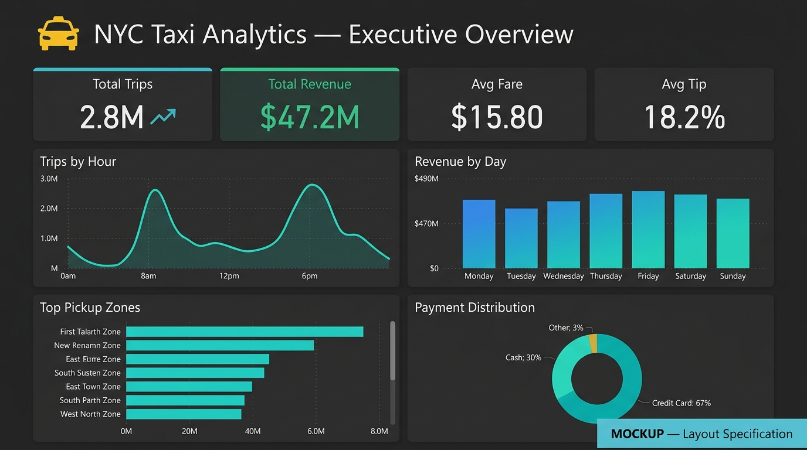

# 📊 Power BI Dashboard — NYC Taxi Analytics

## Overview
This folder contains the specification and instructions for building a
professional 3-page Power BI dashboard from the Gold-layer aggregated
tables produced by this project.

> **Note:** No `.pbix` file is committed to Git because Power BI Desktop
> files are binary and environment-specific. Follow the instructions below
> to build the dashboard from scratch in under 30 minutes.

---

## Data Source Connection

### Option A — Connect to Databricks (Recommended)
1. Open Power BI Desktop → **Get Data** → **Azure Databricks**.
2. Enter your Databricks workspace URL and HTTP path.
3. Authenticate with a Personal Access Token (PAT).
4. Select the Gold tables:
   - `gold_hourly_demand`
   - `gold_daily_demand`
   - `gold_peak_demand`
   - `gold_weekend_weekday`
   - `gold_top_pickup_zones`
   - `gold_top_dropoff_zones`
   - `gold_revenue_by_hour`
   - `gold_revenue_by_zone`
   - `gold_payment_distribution`
   - `gold_distance_distribution`
   - `gold_zone_ranking`
5. Click **Load**.

### Option B — Connect to Local Parquet Files
1. **Get Data** → **Parquet**.
2. Navigate to `data/gold/` and import each subfolder.

---

## Data Model

```
gold_hourly_demand   ──┐
gold_daily_demand    ──┤
gold_peak_demand     ──┤
gold_weekend_weekday ──┼──► All tables are pre-aggregated
gold_revenue_by_hour ──┤    (no relationships needed for
gold_revenue_by_zone ──┤     basic visualizations)
gold_payment_dist    ──┤
gold_zone_ranking    ──┘
```

If you load the full enriched dataset (Silver/Gold), create relationships on:
- `PULocationID` → `taxi_zone_lookup[LocationID]`
- `DOLocationID` → `taxi_zone_lookup[LocationID]`

---

## DAX Measures

Create these measures in Power BI:

```dax
// KPI Card Measures
Total Trips = SUM(gold_hourly_demand[trip_count])

Total Revenue = SUM(gold_revenue_by_hour[total_revenue])

Avg Fare = AVERAGE(gold_revenue_by_hour[avg_revenue])

Avg Tip % =
    DIVIDE(
        SUM(gold_payment_distribution[avg_tip_pct]
            * gold_payment_distribution[trip_count]),
        SUM(gold_payment_distribution[trip_count]),
        0
    )

// Weekday vs Weekend
Weekday Trips =
    CALCULATE(
        SUM(gold_weekend_weekday[trip_count]),
        gold_weekend_weekday[day_type] = "Weekday"
    )

Weekend Trips =
    CALCULATE(
        SUM(gold_weekend_weekday[trip_count]),
        gold_weekend_weekday[day_type] = "Weekend"
    )
```

---

## Dashboard Layout — 3 Pages

### Page 1: Executive Overview
| Visual               | Type              | Source Table            | Fields                                      |
|----------------------|-------------------|------------------------|---------------------------------------------|
| Total Trips          | KPI Card          | gold_hourly_demand     | SUM(trip_count)                             |
| Total Revenue        | KPI Card          | gold_revenue_by_hour   | SUM(total_revenue)                          |
| Average Fare         | KPI Card          | gold_revenue_by_hour   | AVG(avg_revenue)                            |
| Average Tip %        | KPI Card          | gold_payment_dist      | Weighted avg of avg_tip_pct                 |
| Trips by Hour        | Line Chart        | gold_hourly_demand     | X: pickup_hour, Y: trip_count               |
| Revenue Trend        | Area Chart        | gold_revenue_by_hour   | X: pickup_hour, Y: total_revenue            |
| Avg Trip Distance    | KPI Card          | gold_peak_demand       | AVG(avg_distance)                           |
| Avg Trip Duration    | KPI Card          | gold_peak_demand       | AVG(avg_duration_min)                       |

### Page 2: Demand & Zones
| Visual                    | Type              | Source Table            | Fields                                  |
|---------------------------|-------------------|------------------------|-----------------------------------------|
| Trips by Hour             | Column Chart      | gold_hourly_demand     | X: pickup_hour, Y: trip_count           |
| Trips by Day              | Bar Chart         | gold_daily_demand      | Y: pickup_day_name, X: trip_count       |
| Pickup Zone Ranking       | Table / Bar       | gold_top_pickup_zones  | PULocationID, trip_count                |
| Drop-off Zone Ranking     | Table / Bar       | gold_top_dropoff_zones | DOLocationID, trip_count                |
| Demand Heatmap            | Matrix            | gold_hourly + daily    | Rows: day, Cols: hour, Values: count    |
| Weekend vs Weekday        | Donut Chart       | gold_weekend_weekday   | day_type, trip_count                    |

### Page 3: Revenue & Customer Behavior
| Visual                    | Type              | Source Table              | Fields                                |
|---------------------------|-------------------|--------------------------|---------------------------------------|
| Revenue by Hour           | Column Chart      | gold_revenue_by_hour     | X: pickup_hour, Y: total_revenue      |
| Revenue by Zone (Top 10)  | Horizontal Bar    | gold_revenue_by_zone     | PULocationID, total_revenue           |
| Fare Distribution         | Histogram/Bar     | gold_distance_dist       | distance_bucket, avg_fare             |
| Tip Percentage            | Gauge / KPI       | gold_payment_dist        | avg_tip_pct                           |
| Payment Type Dist.        | Pie Chart         | gold_payment_dist        | payment_label, trip_count             |
| Distance vs Fare          | Scatter Chart     | gold_distance_dist       | X: distance_bucket, Y: avg_fare      |

---

## Design Guidelines
- **Theme:** Dark corporate theme (charcoal background, accent colors: teal #00B4D8, gold #FFD60A)
- **Font:** Segoe UI or DIN
- **KPI Cards:** Large font, icon + subtitle
- **Charts:** Consistent color palette, data labels on key points
- **Filters:** Page-level slicer for `day_type` (Weekday / Weekend) and `pickup_hour` range

---

## Preview

> The file `dashboard_preview.png` in this folder is a **MOCKUP** showing
> the intended layout.  It was NOT generated from a live Power BI connection.
> Build the actual dashboard by following the steps above.


